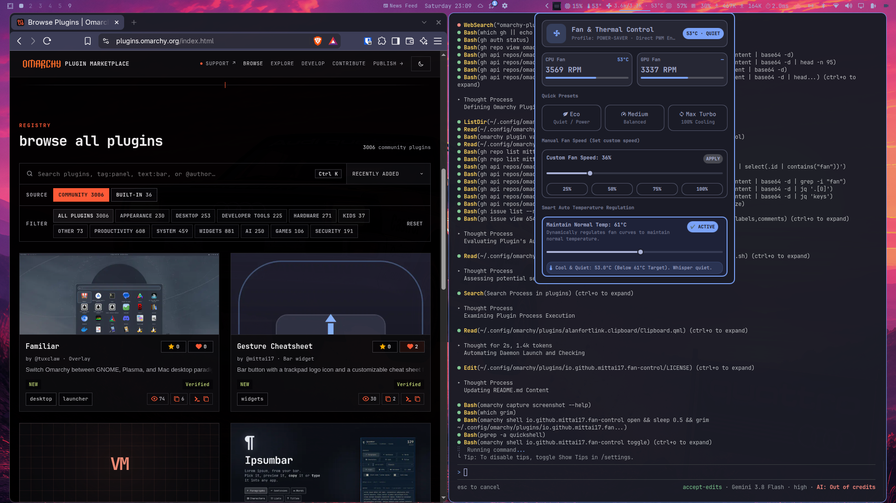

# 󰈐 Fan & Thermal Control

**Universal CPU/GPU fan speed control and intelligent thermal regulation for [Omarchy](https://omarchy.org/) (Quickshell).**

Designed for laptops and desktop PCs, this plugin provides live fan telemetry on the Omarchy status bar, 3 instant quick presets, manual speed control, and an active closed-loop smart auto-maintainer to keep system temperatures cool and normal.



---

## Features

- 󰈐 **Dual / Multi-Fan Hardware Detection**:
  - Automatically reads CPU and GPU/chassis fan RPMs (`fan1_input`, `fan2_input`, etc.) from Linux kernel `hwmon` sysfs.
  - Dynamically calculates fan speed percentages and monitors dual-fan balances.
- ⚡ **3 Simple Levels (Quick Presets)**:
  - **󰌪 Eco**: Whisper-quiet acoustics, power-saver thermal mode, minimal fan RPM for battery saving and quiet environments.
  - **󰓅 Medium**: Balanced fan curve and power profile for smooth multitasking.
  - **󰓦 Max Turbo**: 100% cooling duty blast (~5,400+ RPM) and performance profile for intense gaming, compiling, and heavy workloads.
- 🎛️ **Manual Speed Control**:
  - Precision slider from **15% to 100%** fan duty.
  - Quick-jump preset chips: `25%`, `50%`, `75%`, `100%`.
  - Sets hardware PWM duty (on desktop motherboards & controllable laptop fan chips) and adjusts platform power profiles.
- 🌡️ **Smart Temperature Auto-Maintainer ("Maintain Normal Temp")**:
  - Interactive **Target Normal Temperature** slider (45°C - 75°C, default 60°C).
  - Built-in closed-loop regulator actively monitors thermals:
    - If temperature exceeds Target + 2°C: Automatically engages cooling to bring temperature down.
    - If temperature reaches Critical (≥ 80°C): Triggers emergency Max Turbo cooling to protect hardware.
    - If temperature is comfortably below target: Relaxes fans into quiet operation.
    - Built-in hysteresis prevents noisy fan hunting.
- 📊 **Status Bar Telemetry**:
  - Live readout: `󰈐 3.6k/3.3k · 54°C` (primary fan, secondary fan, and temperature).
  - Dynamic temperature glyph coloring (Eco Cyan, Balanced Foreground, Warm Orange, Critical Urgent Red).
  - **Left-Click**: Toggles interactive control panel.
  - **Right-Click**: Quick cycles modes (`Eco` → `Medium` → `Max` → `Auto`).
  - **Hover Tooltip**: Displays detailed multi-line status and sensor telemetry.

---

## Installation

Install directly using the Omarchy CLI:

```bash
omarchy plugin add https://github.com/mittai17/omarchy-fan-control --enable
```

Place on your Omarchy status bar:

```bash
omarchy bar put io.github.mittai17.fan-control --after io.github.grootaiinfinity.hwmon
```

*(You can also place or reorder it anywhere on your bar using `omarchy bar move io.github.mittai17.fan-control --section right`)*

---

## Removal

Remove via the Omarchy CLI:

```bash
omarchy plugin remove io.github.mittai17.fan-control
```

### Manual Removal

1. Remove the plugin directory:
```bash
rm -rf ~/.config/omarchy/plugins/io.github.mittai17.fan-control
```

2. Remove `"id": "io.github.mittai17.fan-control"` from your bar layout in `~/.config/omarchy/shell.json`.

3. Restart the Omarchy shell:
```bash
omarchy restart shell
```

---

## Requirements & External Dependencies

- **Omarchy 4.x** with **Quickshell**
- **Python 3** (`python3` standard library, no external pip packages required)
- Linux **hwmon** sysfs (`/sys/class/hwmon/`, included in standard Linux kernels)
- Optional: `power-profiles-daemon` (`powerprofilesctl`) or ACPI platform profile kernel driver for system-wide performance profile switching.

---

## Permissions & Security

No sudo or pkexec is required. The plugin operates completely unprivileged, reading real-time telemetry from standard Linux `/sys/class/hwmon/` interfaces and controlling performance profiles through standard user-level ACPI platform profiles (`powerprofilesctl`).

---

## License

[MIT](LICENSE) © 2026 mittai17
